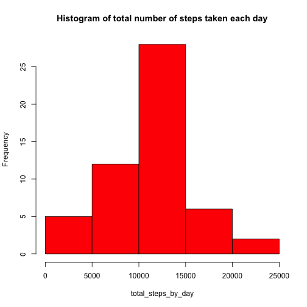
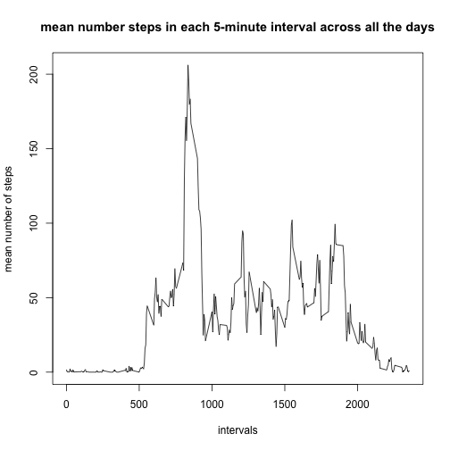
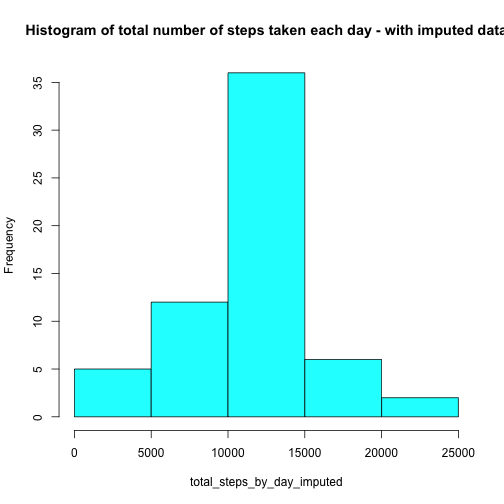
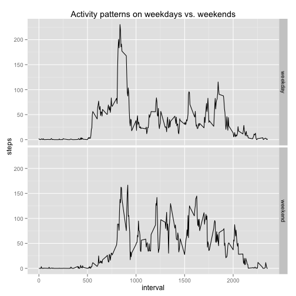

## Loading and preprocessing the data
Load the data and ensure that the date column is in the date format

```r
library(lubridate)
activity_raw_data = read.csv("activity.csv")
activity_raw_data$date = ymd(activity_raw_data$date)
```

## What is mean total number of steps taken per day?
Here is the histogram of total number of steps taken per day followed by the 
mean and median of the number of steps

```r
# Clean the data of any NA values
activity_clean = activity_raw_data[complete.cases(activity_raw_data),]

# Calculate the total number of steps by day
total_steps_by_day = tapply(activity_clean$steps, 
                            factor(activity_clean$date), 
                            sum)
# Create the histogram of the data
hist(total_steps_by_day, 
     main="Histogram of total number of steps taken each day", col="red")
```

 

```r
#Calculate the mean of the mean and median of the total number of steps per day
meanSteps = mean(total_steps_by_day)
meanSteps = format(meanSteps, digits = 7)
medianSteps = median(total_steps_by_day)
```
The mean of the total number of steps taken per day is: 10766.19   
The median of the total number of steps taken per day is: 10765

## What is the average daily activity pattern?
1. Here is the time-series plot of the average across all days of the number of
steps taken in each 5-minute interval

```r
# calculate the mean of the steps taken in each interval, across all days
mean_steps_by_interval = tapply(activity_clean$steps,
                                factor(activity_clean$interval),
                                mean)

# create a time series plot
plot(row.names(mean_steps_by_interval), mean_steps_by_interval, 
     xlab="intervals",ylab="mean number of steps", 
     main="mean number steps in each 5-minute interval across all the days",
     type="l")
```

 

```r
# Figure out which interval on average has the maximum number of steps
maxIntervalIndex = which.max(mean_steps_by_interval)
maxInterval = row.names(mean_steps_by_interval)[maxIntervalIndex]
```
2. The 5-minute interval, on average across all the days in the dataset, which 
contains the maximum number of steps is: 835

## Imputing missing values


```r
# get the rows with NA as the number of steps
activity_na_data = activity_raw_data[is.na(activity_raw_data$steps),]
number_of_missing_values = nrow(activity_na_data)
```
The number of missing values in the dataset is: 2304  

**Strategy for missing values:**  
Use the mean for the 5-minute interval. Leverage the vector of the mean steps
taken in each interval over all the days that was computed earlier.  
**Approach:** for each row of the activity_na_data data frame, get the activiy 
ID. For that activity ID, get the corresponding average number of steps and 
update the imputed data frame


```r
# initialize the imputed data frame with the raw data
activity_imputed_data = activity_raw_data

# fill in the rows with NA as steps with average steps for that interval
activity_imputed_data[row.names(activity_na_data), "steps"] = 
    mean_steps_by_interval[as.character(activity_na_data$interval)]

# create histogram
# Calculate the total number of steps by day
total_steps_by_day_imputed = tapply(activity_imputed_data$steps, 
                            factor(activity_imputed_data$date), 
                            sum)
# Create the histogram of the data
hist(total_steps_by_day_imputed, 
     main="Histogram of total number of steps taken each day - with imputed data", 
     col="cyan")
```

 

```r
#Calculate the mean of the mean and median of the total number of steps per day
meanSteps_imputed = format(mean(total_steps_by_day_imputed), digits = 7)
medianSteps_imputed = format(median(total_steps_by_day_imputed), digits=7)
```
The updated mean of the total number of steps taken per day is: 
10766.19   
The updated median of the total number of steps taken per day is: 
10766.19

## Are there differences in activity patterns between weekdays and weekends?
Here we compare the activity patterns in Weekdays vs. weekends

```r
library(reshape2)
library(ggplot2)

#start by adding a day of week column to the imputed dat set
activity_imputed_data$dayOfWeek = weekdays(activity_imputed_data$date)

# Iterate through the rows and replace the day of week with 'weekday' or 'weekend'
counter = 1
for (dayOfWeek in activity_imputed_data$dayOfWeek)
{
    if(dayOfWeek == "Saturday" | dayOfWeek == "Sunday")
    {
        activity_imputed_data[counter, "dayOfWeek"] = "weekend"
    }
    else
    {
        activity_imputed_data[counter, "dayOfWeek"] = "weekday"
    }
    counter = counter + 1
}

# Reshape the data to be indexed on day of week and interval id
activity_melt = melt(activity_imputed_data, 
                     id = c("dayOfWeek", "interval"),
                     measure.vars = c("steps"))
# Cast the data based on interval and day of week as ID and summarized on mean
activity_cast_interval_means = dcast(activity_melt, 
                                     dayOfWeek + interval ~ variable,
                                     mean)

# Now, plot the distribution
gplot = qplot(interval, steps, 
              data=activity_cast_interval_means, 
              facets = dayOfWeek~.,
              geom=c("line"),
              main = "Activity patterns on weekdays vs. weekends")
print(gplot)
```

 
